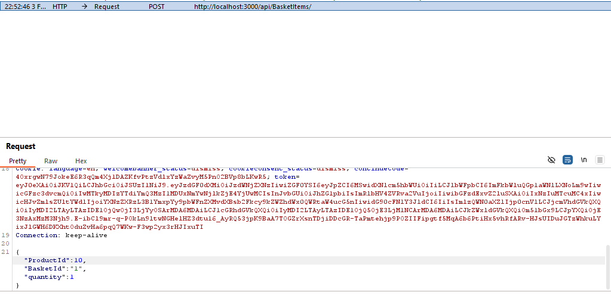
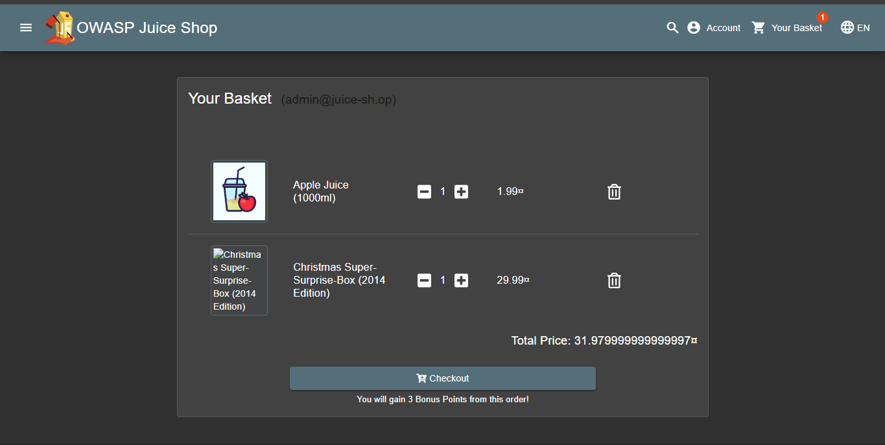
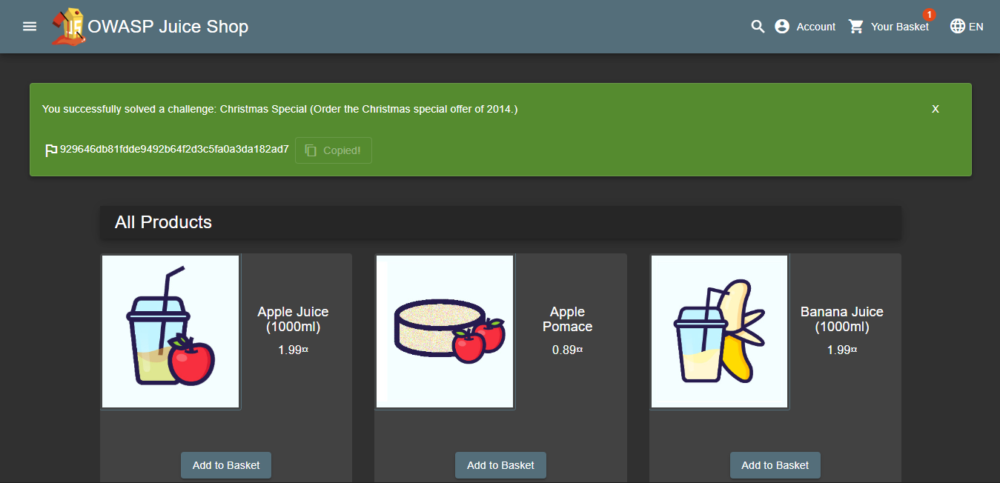

# Proof of Concept: Christmas Special Challenge

**Target:** OWASP Juice Shop

**Category:** Broken Access Control (IDOR) / Sensitive Data Exposure

---

###  1. Deskripsi Challenge

Pesan penawaran spesial Natal tahun 2014.

###  2. Analisis Masalah

Berdasarkan investigasi pada alur bisnis aplikasi, ditemukan celah pada penanganan ID produk dan kebocoran informasi melalui endpoint API yang berbeda.

* **Discrepancy Data (Ketidaksesuaian Data):**
Terdapat perbedaan jumlah data antara produk yang ditampilkan ke user dengan data stok yang ada di database.
* Endpoint `Search` (UI User) hanya menampilkan **36 produk**.
* Endpoint `Quantities` (API) menampilkan stok untuk **46 produk**.
Ini mengindikasikan ada 10 produk yang disembunyikan namun masih tercatat di database.


* **Information Leakage (Kebocoran Informasi):**
Dua endpoint terpisah membocorkan potongan informasi yang ketika digabungkan (korelasi data), dapat mengungkap ID produk tersembunyi:
1. `rest/admin/application-configuration`: Menampilkan daftar **Nama Produk** secara terurut, tapi tanpa ID.
2. `api/Quantities`: Menampilkan daftar **ID Produk** secara terurut (Ascending), tapi tanpa Nama.


* **Broken Access Control (IDOR):**
Mekanisme "Add to Basket" (Tambah ke Keranjang) mempercayai input `ProductId` dari pengguna tanpa memvalidasi apakah produk tersebut berstatus *active* atau *for sale*.

| Endpoint / Sumber | Data yang Tampil | Jumlah Data | Temuan Analisis |
| --- | --- | --- | --- |
| **UI Search** | Produk Lengkap (Valid) | 36 Item | Hanya produk aktif. |
| **API Quantities** | ID & Stok | **46 Item** | Terdapat 10 item "hantu" (hidden). Urutan Ascending by ID. |
| **App Configuration** | Nama Produk | - | Urutan sesuai dengan urutan ID di database. |

---

###  3. Langkah Penyelesaian (Exploitation)

Berikut adalah langkah-langkah teknis untuk mengeksploitasi celah tersebut:

1. **Reconnaissance & Korelasi Data:**
Dengan membandingkan urutan data dari `application-configuration` (Nama) dan `Quantities` (ID), ditemukan pola urutan yang sama.
* Pada urutan ke-10 di *Configuration*, terdapat nama produk yang berkaitan dengan **"Christmas Special"**.
* Pada urutan ke-10 di *Quantities*, ID produknya adalah **10**.
* **Kesimpulan:** Target Product ID adalah `10`.


2. **Intercept Traffic:**
Lakukan proses pembelian barang sembarang (misal: Apple Juice) dan *intercept* request tersebut menggunakan **Burp Suite** atau Network Tools saat menekan tombol "Add to Basket".
3. **Payload Manipulation (IDOR):**
Pada body request method `POST` ke endpoint `/api/BasketItems`, ubah nilai `ProductId` menjadi ID target yang telah ditemukan.
**Original Request (Contoh):**
```json
{
  "ProductId": 1,
  "BasketId": "5",
  "quantity": 1,
  "detail": "..."
}

```


**Modified Payload:**
Ubah `ProductId` menjadi `10`.
```json
{
  "ProductId": 10,  <-- Manipulasi ID di sini
  "BasketId": "5",
  "quantity": 1,
  "detail": "..."
}

```


4. **Eksekusi:**
Teruskan (*Forward*) request yang telah dimodifikasi ke server. Server akan memproses ID `10` dan memasukkan "Christmas Special 2014" ke dalam keranjang, memicu penyelesaian challenge.

---

###  4. Flag (Evidence)

Berikut adalah bukti bahwa produk tersembunyi berhasil dimasukkan ke dalam keranjang belanja:

## (929646db81fdde9492b64f2d3c5fa0a3da182ad7)


---
