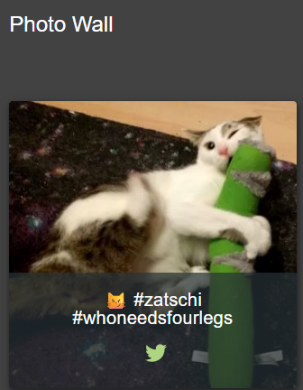

---

# Proof of Concept: Missing Encoding Challenge

**Target:** OWASP Juice Shop

**Category:** Broken Access Control / Improper Input Validation

---

### 📝 1. Deskripsi Challenge

Mendapatkan foto kucing milik Bjoern dalam kondisi "melee combat-mode" yang tersembunyi di halaman **Photo Wall**.

### 🔍 2. Analisis Masalah

Pada halaman Photo Wall, terdapat satu placeholder gambar yang rusak (*broken image*). Setelah dilakukan investigasi, ditemukan akar masalah sebagai berikut:

* **Identifikasi URL:** Melalui *Inspect Element*, ditemukan path file adalah `assets/public/images/uploads/bjoern_cat#melee.jpg`.
* **Karakter Ilegal:** Karakter `#` dalam URL standar dianggap sebagai **Fragment Identifier**.
* **Perilaku Server:** Browser tidak mengirimkan data apapun yang berada setelah karakter `#` ke server. Akibatnya, server hanya menerima request untuk `bjoern_cat`, yang mana file tersebut tidak ada.

| Komponen | Nilai Asli | Masalah |
| --- | --- | --- |
| **Path** | `.../uploads/bjoern_cat` | Diterima Server (Salah) |
| **Fragment** | `#melee.jpg` | Diabaikan oleh Browser |

---

### 🛠️ 3. Langkah Penyelesaian (Exploitation)

1. **Intercept/Inspect:** Buka browser Developer Tools (F12) dan temukan elemen gambar yang rusak.
2. **URL Encoding:** Ubah karakter khusus `#` menjadi format yang bisa dimengerti server sebagai bagian dari nama file.
* **Karakter:** `#`
* **Hex Code:** `23`
* **Encoded:** `%23`


3. **Modifikasi Path:** Gabungkan kembali URL dengan karakter yang sudah di-encode.

**Perbandingan URL:**

```http
[Original]  http://localhost:3000/assets/public/images/uploads/ᓚᘏᗢ-#zatschi-#whoneedsfourlegs-1572600969477.jpg
[Modified]  http://localhost:3000/assets/public/images/uploads/ᓚᘏᗢ-%23zatschi-%23whoneedsfourlegs-1572600969477.jpg

```

4. **Akses Gambar:** Masukkan URL yang telah dimodifikasi ke tab baru browser. Gambar kucing akan muncul dan notifikasi "Challenge Solved" akan terpicu.

---

### 🏁 4. Flag (Evidence)

Berikut adalah bukti keberhasilan akses gambar kucing Bjoern:


---